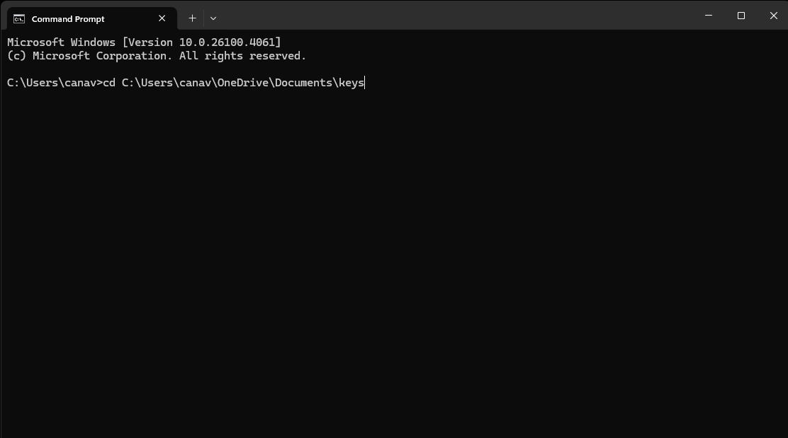

# BEGINNING
To deploy a blog website, first, we need to open an AWS EC2 account! To do that, we just need to
Go to Amazon's dedicated website. You can click [here](https://aws.amazon.com/free) and navigate there easily.  
 
You will see a page similar to this one. Just proceed to create an account!
## LACUNHING AN INSTANCE
After registering an account, you should navigate to the instance section.  
 
You will see a scene similar to this. Proceed to click on the "Launch Instances" button. It should be somewhere to the top right.
Then we will choose what type of image (operating system) we want to work with.  
  This documentation will be written for Ubuntu (Linux).
After choosing our image type, we will proceed to select our instance type. This is actually a physical device that our provider rents us, Infrastructure as a Service. 
  
We will proceed with a t2.micro instance.
Now, we need to create a key to be able to connect our instance remotely. This protocol is called SSH. Its key features are encrypting our data and transferring.  
  
And then we will see the networking settings section. We can use the default settings or configure them at this point.  
  
Because we want a website that is reachable from anywhere around the world via the internet, we need to open some ports! 
 
We can do it by clicking one of the security groups we see in the picture. Then we will click the security group we see.
There, we will open some ports. It should look something like this when we finish.
 
### SSH into our device
When we created the key, it should have automatically downloaded. We are going to open the location where our key exists from our command prompt. 
 
Then you will have access to your instance!
##   Apache and MySql
From here on, we will be updating and installing the things for our blog website! I will be installing WordPress for easy customisation because I don't have much time left for customisation, but I think that would be a better learning experience! 
Update System and Install Dependencies
<pre><code>sudo apt update
sudo apt install apache2 php libapache2-mod-php mysql-server php-mysql unzip curl -y </code></pre> 

**sudo apt update** 
What it does:
Refreshes your system’s list of available packages from the Ubuntu repositories. 
Why it matters:
Ensures you’re installing the latest secure versions of software, not outdated ones. 

**sudo apt install apache2 php libapache2-mod-php mysql-server php-mysql unzip curl -y** 
This installs a set of tools required for WordPress: 
Package	Purpose 
apache2 -> The web server. Serves your website to the internet. 
php	-> The programming language WordPress is written in. 
libapache2-mod-php -> Connects PHP with Apache, allowing Apache to interpret .php files. 
mysql-server	-> Database engine where WordPress stores posts, users, etc. 
php-mysql	-> PHP extension that lets WordPress talk to MySQL databases. 
unzip	-> Allows us to unzip the WordPress .zip archive later. 
curl	-> Command-line tool for downloading files (we’ll use it for WordPress). 
-y	-> Automatically answers “yes” to install prompts, so the process runs smoothly. 
###Create MySQL Database for WordPress
Now, our goal is to create a database for our website, allowing us to store the data securely.
First, we are going to enter the MySQL terminal
<pre><code>sudo mysql</code></pre> 
**Why?** 
This opens MySQL’s interactive prompt as the root user (super admin) so you can create and manage databases.
Once inside the MySQL prompt (mysql>), we are going to run these one line at a time:
<pre><code>CREATE DATABASE blogdb;
CREATE USER 'admin'@'localhost' IDENTIFIED BY 'Strongpassword123';
GRANT ALL PRIVILEGES ON blogdb.* TO 'admin'@'localhost';
FLUSH PRIVILEGES;
EXIT;</code></pre> 
CREATE DATABASE blogdb; 
**What this does:** 
Creates a new database called blogdb where all your WordPress content will live.  
CREATE USER 'bloguser'@'localhost' IDENTIFIED BY 'StrongPassword123!'; 
**Explanation:** 
bloguser: your custom database username 
'localhost': allows login only from this machine (good for security) 
'StrongPassword123!': your secure password (change it as needed) 

GRANT ALL PRIVILEGES ON blogdb.* TO 'bloguser'@'localhost'; 
Give that user access to the database: 
**Meaning:** 
blogdb.*: All tables in the blogdb database 
This gives your WordPress user full read/write access 

FLUSH PRIVILEGES; 
Apply changes immediately: 
**Why?** 
MySQL caches privilege changes. This command reloads them so they take effect without needing a restart. 

**Exit** MySQL 
EXIT;

### Download and Install WordPress
**Navigate to a temporary working directory:** 
cd /tmp 
**Why?** 
The /tmp directory is a safe space for temporary files. We download and unzip WordPress here to keep the server tidy. 
**Download the latest version of WordPress:** 
curl -O https://wordpress.org/latest.zip 
Explanation: 
curl is a command-line downloader. 
-O saves the file with its original name (latest.zip). 
This pulls the official, clean WordPress archive from wordpress.org. 
