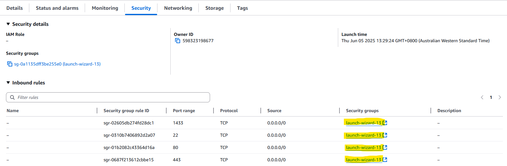

# BEGINNING
To deploy a blog website, first, we need to open an AWS EC2 account! To do that, we just need to
Go to Amazon's dedicated website. You can click [here](https://aws.amazon.com/free) and navigate there easily.  
 
You will see a page similar to this one. Just proceed to create an account!
## LACUNHING AN INSTANCE
After registering an account, you should navigate to the instance section.  
 
You will see a scene similar to this. Proceed to click on the "Launch Instances" button. It should be somewhere to the top right.
Then we will choose what type of image (operating system) we want to work with.  
  This documentation will be written for Ubuntu (Linux).
After choosing our image type, we will proceed to select our instance type. This is actually a physical device that our provider rents us, Infrastructure as a Service. 
  
We will proceed with a t2.micro instance.
Now, we need to create a key to be able to connect our instance remotely. This protocol is called SSH. Its key features are encrypting our data and transferring.  
  
And then we will see the networking settings section. We can use the default settings or configure them at this point.  
  
Because we want a website that is reachable from anywhere around the world via the internet, we need to open some ports! 
 
We can do it by clicking one of the security groups we see in the picture. Then we will click the security group we see.
There, we will open some ports. It should look something like this when we finish.
 
### SSH into our device
When we created the key, it should have automatically downloaded. We are going to open the location where our key exists from our command prompt.

